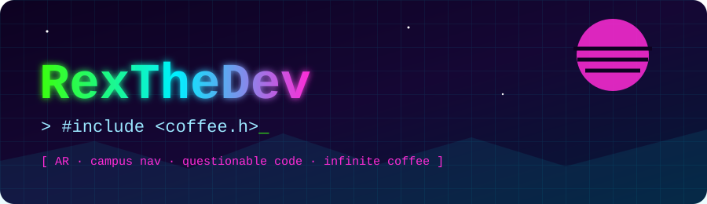

<p align="center">
  
</p>

<p align="center">
  
  
  
  
</p>

<p align="center">
  
</p>

---

## 🖥️ `~/whoami`

```console
rex@dev:~$ cat about.json
{
  "name": "Rex",
  "handle": "manu-1230",
  "role": "Full-stack tinkerer / AR enthusiast",
  "currently": "Waymakers 2 - QR-anchored AR campus navigation",
  "learning": ["Rust", "WebGL", "sleeping"],
  "fuel": "coffee",
  "compiles_first_try": false
}
rex@dev:~$ _
```

## 🧰 Arsenal

<p align="center">
  
</p>

## 🚀 Featured Projects

<table>
  <tr>
    <td width="50%">
      <h3>🧭 waymakers-lite</h3>
      <p>Scan a QR code, get a floating arrow. The arrow points <i>roughly</i> forward.</p>
       
    </td>
    <td width="50%">
      <h3>☕ quantum-coffee-brewer</h3>
      <p>Coffee that is hot and cold simultaneously until observed.</p>
       
    </td>
  </tr>
  <tr>
    <td>
      <h3>🖥️ neon-terminal</h3>
      <p>A terminal with 400% more glow and 0% more functionality.</p>
       
    </td>
    <td>
      <h3>🐾 pixel-pet-os</h3>
      <p>An operating system whose only feature is a very sad pixel dog.</p>
       
    </td>
  </tr>
  <tr>
    <td>
      <h3>✅ sentient-todo</h3>
      <p>A todo app that judges your procrastination. Gently. Not really.</p>
       
    </td>
    <td>
      <h3>🦆 rubber-duck-ai</h3>
      <p>Rubber duck debugging, now with strong opinions.</p>
       
    </td>
  </tr>
</table>

<details>
<summary>🏆 <b>Achievements unlocked</b> (click me)</summary>

- 🥇 **Hello, World:** printed it, no segfault
- 🔥 **Stack Overflow Tourist:** copy, paste, pray
- 🌙 **3AM Club:** committed at an hour that should be illegal
- ☕ **Caffeine Overlord:** blood type is now espresso
- 🧯 **Production Whisperer:** broke it, fixed it, told no one

</details>

## 📊 Stats

<p align="center">
  
  
</p>
<p align="center">
  
</p>

## 📫 Say hi

<p align="center">
  <a href="mailto:al.jhorge22@gmail.com"></a>
  <a href="https://github.com/manu-1230"></a>
</p>

<p align="center"></p>
